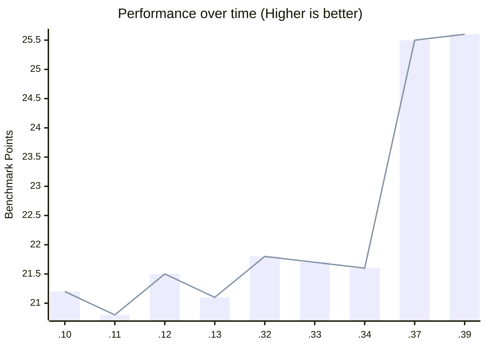
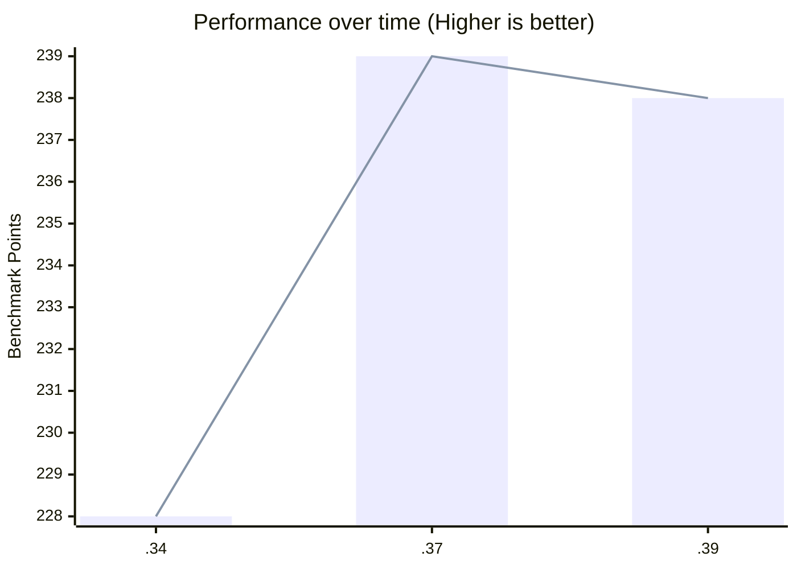
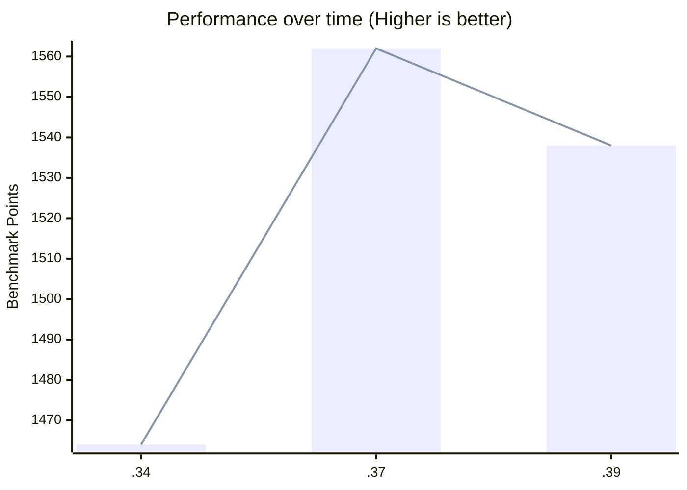
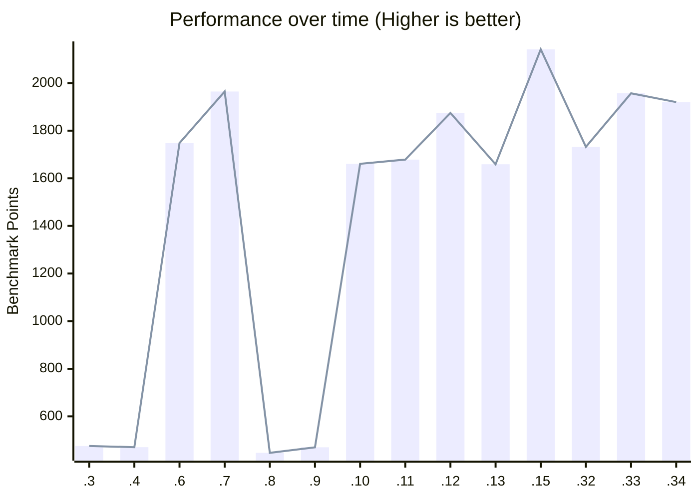

These benchmarks were performed on a device with the following specifications:
* Windows 11
* Intel® Core i5-13600K Processor

> [!warning]
> These benchmarks only focus on specific performance aspects of a browser, and your personal results may vary drastically depending on your hardware.
> This page is not a definitive indicator of overall browser speed.

> [!notes] Where are the latest versions?
> This page is maintained by [NOCanoa](https://github.com/NOCanoa). These benchmarks are only updated when he is available.

## [Browserbench.org](https://browserbench.org/)

### [Speedometer 3.0](https://browserbench.org/Speedometer3.0/)

| Version | Score |
|-----------|-----|
| 1.0.0-a39-opt | 25.6 |
| 1.0.0-a37-opt | 25.5 |
| 1.0.0-a34-opt | 21.6 |
| 1.0.0-a33-opt | 21.7 |
| 1.0.0-a32-opt | 21.8 |
| 1.0.0-a.13-opt | 21.1   |
| 1.0.0-a.12-opt | 21.5   |
| 1.0.0-a.11-opt | 20.8   |
| 1.0.0-a.10 | 21.2 |
| Vivaldi 6.7.3329.39| 27.8 |
| FF nightly 130.0a1 | 27.0 |
| Librewolf 128.0-2 | 20.2 |

### [JetStream 2.2](https://browserbench.org/JetStream/)

| Version | Score |
|-----------|-----|
| 1.0.0-a39-opt | 238 |
| 1.0.0-a37-opt | 239 |
| 1.0.0-a34-opt | 228 |

### [MotionMark](https://browserbench.org/MotionMark1.3.1/)

| Version | Score |
|-----------|-----|
| 1.0.0-a39-opt | 1538 |
| 1.0.0-a37-opt | 1562 |
| 1.0.0-a34-opt | 1464 |

## [Basemark Web 3.0](https://web.basemark.com/)

| Version   | Score  |CSS | HTML5 | Page Responsiveness |
|-----------|-----|-----|-------|------------------------------|
| 1.0.0-a.X| --- | --- | --- | --- | --- |
| 1.0.0-a.34-opt | 1920 | 59% | 91% | 91% | 76% |
| 1.0.0-a.33-opt | 1957 | 59% | 91% | 91% | 76% |
| 1.0.0-a.32-opt | 1732 | 59% | 91% | 90% | 76% |
| 1.0.0-a.15-opt | 2141 | 59% | 91% | 90% | 76% |
| 1.0.0-a.13-opt | 1658 | 59% | 91% | 90% | 76% |
| 1.0.0-a.12-opt | 1874 | 59% | 91% | 91% | 76% |
| 1.0.0-a.11-opt | 1678 | 59% | 91% | 91% | 76% |
| 1.0.0-a.10 | 1660 | 59% | 91% | 91% | 76% |
| 1.0.0-a.9 | 470 | ---  | --- | ---  | ---  |
| 1.0.0-a.8 | 446.74  | 59% | 91%   | 96%                          |
| 1.0.0-a.7 | 1964.43 | 59% | 91%   | 91%                          |
| 1.0.0-a.6 | 1747.98 | 59% | 91%   | 91%                          |
| 1.0.0-a.4 | 470.49  | 59% | 91%   | 97%                          |
| 1.0.0-a.3 | 475.52  |59% | 91%   | 97%                           |
| Librewolf 128.0-2 | 1953.65 | 59.66% | 89.01%   | 91.72%        |
| FF nightly 130.0a1 | 1912.77 | 59.66% | 90.91%  | 91.72%        |

