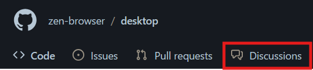

Contributing to the Zen Browser Desktop project is a great way to get involved with open-source software development. This guide will walk you through the steps to clone the project, set up your development environment, make contributions, and submit pull requests.

## Prerequisites

Before you begin, ensure you have the following tools installed:

- [**Git**](https://git-scm.com/): Version control system to clone the repository and manage your code.
- [**Node.js**](https://nodejs.org/): Required for building the browser.
- [**npm**](https://www.npmjs.com/): Node package manager, which comes with Node.js.



## Step 6: Making a Contribution

### Types of Contributions

You can contribute to Zen Browser in various ways, including:

- **Bug Fixes**: Identify and fix bugs in the codebase.
- **Feature Development**: Implement new features or enhance existing ones.
- **Documentation**: Improve or expand the project's documentation.
- **Code Optimization**: Refactor the code for better performance or readability.
- **UI/UX Improvements**: Enhance the user interface or user experience.

### Guidelines for Contributions

Before contributing, please keep the following guidelines in mind:

- **Follow the [Code of Conduct](/contribute/code_of_conduct/)**: Be respectful and constructive in your interactions.
- **Stick to the Coding Standards**: Ensure your code adheres to the project's coding conventions. This includes proper indentation, comments, and naming conventions.
- **Write Clear Commit Messages**: Your commit messages should be descriptive and concise.
- **Test Your Changes**: Ensure that your code changes do not break existing functionality. Write tests if applicable.

### How to Make a Pull Request

1. **Fork the Repository**: Create a fork of the Zen Browser repository on GitHub.
    
2. **Create a New Branch**: It’s a good practice to create a new branch for each feature or bug fix.
   
    ```bash
    git checkout -b feature/your-feature-name
    ```
    
3. **Make Your Changes**: Edit the code in your local repository.
    
4. **Commit Your Changes**: Commit your changes with a descriptive message.
   
    ```bash
    git commit -m "Add feature: your feature description"
    ```
    
5. **Push Your Changes**: Push your branch to your forked repository.
   
    ```bash
    git push origin feature/your-feature-name
    ```

6. **Submit a Pull Request**: Go to the original Zen Browser repository and submit a pull request from your forked repository.
    
    - Provide a clear title and description of your changes.
    - Reference any relevant issues in the pull request.

## Additional Resources

- [Zen Browser GitHub Repository](https://github.com/zen-browser/desktop): The main repository where you can find the source code and submit pull requests.
- [Contribution Guidelines](/contribute/contributing/)
- [Code of Conduct](/contribute/code_of_conduct/)
  
---

Thank you for contributing to Zen Browser! Your contributions are valuable and help make the project better for everyone.